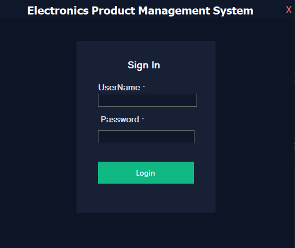
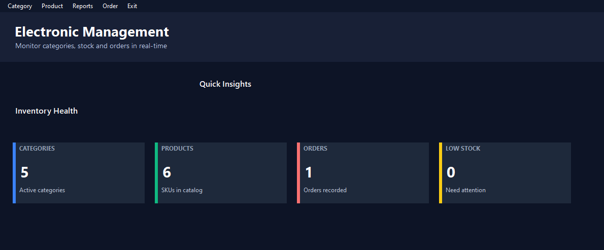
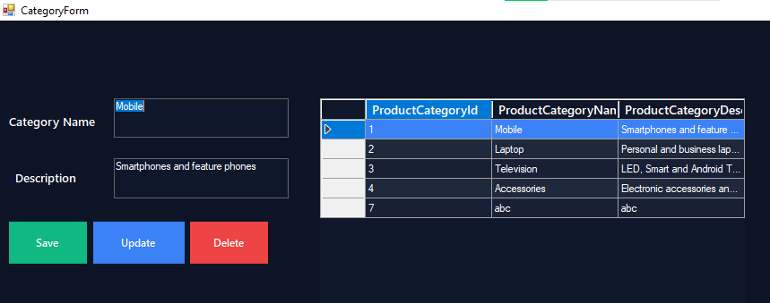
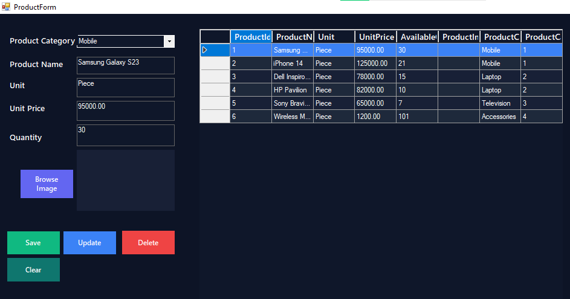
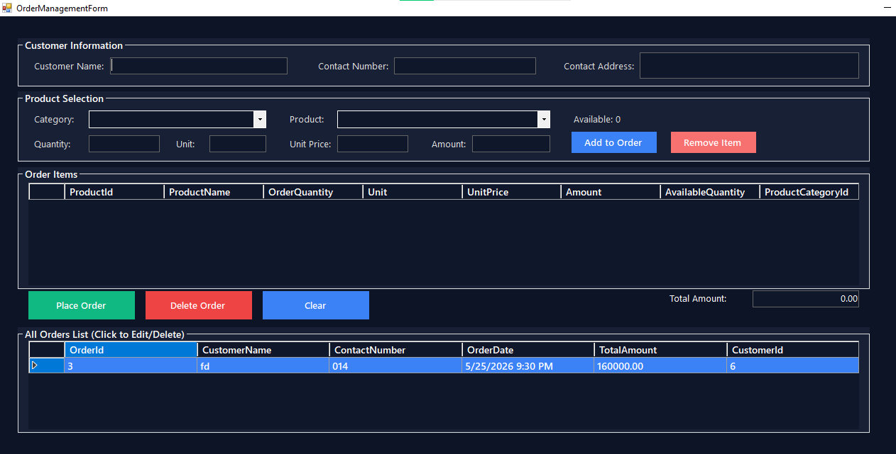

# Electronics Management System (WinForms)

A desktop inventory and order management application built with **C# Windows Forms** for managing electronics categories, products, and customer orders, with SQL Server-backed persistence and Crystal Reports integration.

This README is generated by analyzing the source code in this repository. Where implementation details are not fully explicit, assumptions are clearly marked.

## Project Overview

This solution is a classic **.NET Framework 4.8 WinForms** application that provides:

- Login-gated access to the system
- Product category management
- Product management (including image handling)
- Order creation and order lifecycle management
- Dashboard statistics
- Crystal Reports-based reporting screens

The application appears designed for small-to-medium inventory workflows in an electronics retail/stock environment.

## Key Features

### Authentication

- Login form with credential validation
- Opens the main dashboard after successful login
- Empty input validation and exit control

> **Assumption:** Authentication is local/hardcoded (not database user management), based on current code behavior.

### Dashboard

- Category count
- Product count
- Order count
- Low-stock indicator
- Navigation menus to modules and reports

### Category Management

- Create category
- View category list in `DataGridView`
- Update selected category
- Delete category with confirmation

### Product Management

- Create, read, update, delete products
- Product linked to category
- Stock quantity and price management
- Product image browse/upload
- Local image copy/store under app directory
- Image replacement and delete on product update/delete

### Order Management

- Customer details capture (name, contact, address)
- Category-wise product filtering
- Add multiple line items to an order
- Quantity validation against available stock
- Auto amount and total calculations
- Place new orders
- Edit existing orders
- Delete orders
- Stock rollback on order delete/update
- Transaction-based multi-table operations

### Reporting

- Crystal Reports viewer forms
- Menu-driven report launching from main form

## Technology Stack

- **Language:** C#
- **Application Type:** Windows Forms Desktop App
- **Framework:** .NET Framework 4.8
- **Database:** SQL Server LocalDB (`(LocalDB)\MSSQLLocalDB`)
- **Data Access:** ADO.NET (`System.Data.SqlClient`) + helper class abstraction
- **Reporting:** SAP Crystal Reports for .NET (`CrystalDecisions.*`)
- **Project Format:** Non-SDK style `.csproj` (classic Visual Studio project)

## NuGet / Dependencies

No explicit `packages.config` or `PackageReference` entries were found in the project file.  
Crystal Reports assemblies are referenced directly in the `.csproj`.

Referenced Crystal assemblies:

- `CrystalDecisions.CrystalReports.Engine`
- `CrystalDecisions.ReportSource`
- `CrystalDecisions.Shared`
- `CrystalDecisions.Windows.Forms`

## Database Design

A SQL setup script is available:

- `Database/SQLQuery1.sql`

The script defines and/or uses the following core tables:

- `ProductCategory`
- `Product`
- `Customer`
- `Orders`
- `OrderDetails`

Observed relational behavior:

- Foreign-key relationships between category/product and order/header-detail entities
- `OrderDetails` linked with `ON DELETE CASCADE` to `Orders`

## Database Configuration

### 1) Create/Initialize the Database

1. Open **SQL Server Management Studio (SSMS)** or Visual Studio SQL tools.
2. Connect to:
   - `Server: (LocalDB)\MSSQLLocalDB`
   - Authentication: Windows Authentication
3. Run `Database/SQLQuery1.sql` to create schema and seed sample data (if included in your script revision).

### 2) Verify Connection String

Connection settings are currently defined in:

- `App.config`
- `Properties/Settings.settings`

Default connection in codebase points to:

`Data Source=(LocalDB)\MSSQLLocalDB;Initial Catalog=ElectronicManagementDB;Integrated Security=True`

If your SQL instance or DB name differs, update connection strings accordingly.

> **Assumption:** `App.config` connection key `DbCon` is the primary runtime connection used by core forms.

### 3) Crystal Reports Runtime (Important)

If reports fail to load, install the matching **SAP Crystal Reports runtime** version required by your referenced assemblies (commonly Crystal Reports 13.x for VS).

> **Assumption:** Runtime package/version is not explicitly documented in-source, so matching assembly version is required during setup.

## Getting Started (Visual Studio)

### Prerequisites

- Windows OS
- Visual Studio (with .NET desktop development workload)
- .NET Framework 4.8 Developer Pack / Targeting Pack
- SQL Server LocalDB (`MSSQLLocalDB`)
- (Optional but recommended) SSMS for running SQL scripts
- Crystal Reports runtime for report forms

### Installation Steps

1. Clone/download this repository.
2. Open `MyProject.sln` in Visual Studio.
3. Restore/build references (if prompted).
4. Configure database using `Database/SQLQuery1.sql`.
5. Confirm connection strings in `App.config`.
6. Build the solution (`Build > Build Solution`).
7. Run the app (`F5`).

### Run Flow

1. Launch application.
2. Login from `LoginForm`.
3. Use `MainForm` to navigate to:
   - Category Management
   - Product Management
   - Order Management
   - Reports

## Login Information

Based on current implementation, login is hardcoded in the source.

> **Assumption:** Default credential appears to be `admin / 1234` from login form logic.  
> For production, replace with secure DB-backed authentication and hashed passwords.

## Project Structure

```text
.
├── MyProject.sln
├── MyProject.csproj
├── App.config
├── Program.cs
├── MainForm.cs
├── DataAccess/
│   └── DBHelpers.cs
├── Forms/
│   ├── LoginForm.cs
│   ├── CategoryForm.cs
│   ├── ProductForm.cs
│   └── OrderManagementForm.cs
├── Report/
│   ├── Form1.cs
│   ├── OrderForm.cs
│   ├── CrystalReport1.cs
│   └── CrystalReport2.cs
├── Database/
│   └── SQLQuery1.sql
├── ElectronicManagementDBDataSet.xsd
└── Properties/
    └── Settings.settings
```

> Note: Additional designer/resource/generated files are omitted for readability.

## Screenshots

Add screenshots to a `docs/screenshots/` folder and update paths below.

- 
- 
- 
- 
- 

## Known Limitations / Assumptions

- Authentication is hardcoded (not role-based, not DB-driven).
- No explicit migration/versioning workflow for database schema.
- Crystal Reports runtime/version requirement is implicit.
- Connection string definitions exist in multiple places and should be standardized.
- Product images are stored on local filesystem under app startup path.

## Future Improvements

- Replace hardcoded login with secure user/role management
- Introduce password hashing and access control
- Add layered architecture (UI, service, repository) for maintainability
- Add centralized exception logging
- Add unit/integration tests
- Add installer/publishing profile and environment-specific configs
- Move from LocalDB to full SQL Server/Azure SQL for multi-user deployments
- Implement asynchronous DB operations for better UI responsiveness
- Add advanced reporting filters/export (PDF/Excel)

## Contributing

Contributions are welcome.

1. Fork the repository
2. Create a feature branch (`feature/your-feature-name`)
3. Commit focused changes with clear messages
4. Run and verify the full workflow (login, CRUD, orders, reports)
5. Open a Pull Request with:
   - Problem statement
   - Change summary
   - Screenshots (if UI changes)
   - Test/verification notes

## License

No license file is currently present in the repository.

> **Assumption:** All rights reserved by default unless a license (for example, MIT/Apache-2.0) is added.

If you want this project open-source friendly, add a `LICENSE` file and update this section.

---

If needed, this README can be further customized for:

- recruiter/portfolio presentation style,
- enterprise handover documentation,
- or deployment-focused operational documentation.
